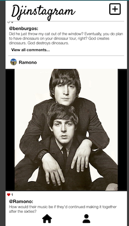

# Djinstagram

*A basic Instagram clone in Django written by:*

- Ramon Velarde | https://github.com/Rvelarde83
- Ben Burgos | https://github.com/benburgos
- Rich Clarke | https://github.com/richclarke0

### *Wireframes, relational diagrams, and other data are available for viewing via this [Miro board link](https://miro.com/app/board/uXjVOkp0SE4=/?share_link_id=42094080267).*

[https://djinstagram-was-taken.herokuapp.com/](https://djinstagram-was-taken.herokuapp.com/)

### Technologies Used:
- Django
- django-environ (for environmental variables)

|Screenshot of live app:|
|----------|
||

Future enhancements: 
- It would be cool to be able to delete comments.
- Get the profile rendering to work for other peoples profiles instead of the logged in user.
- Friend functionality.